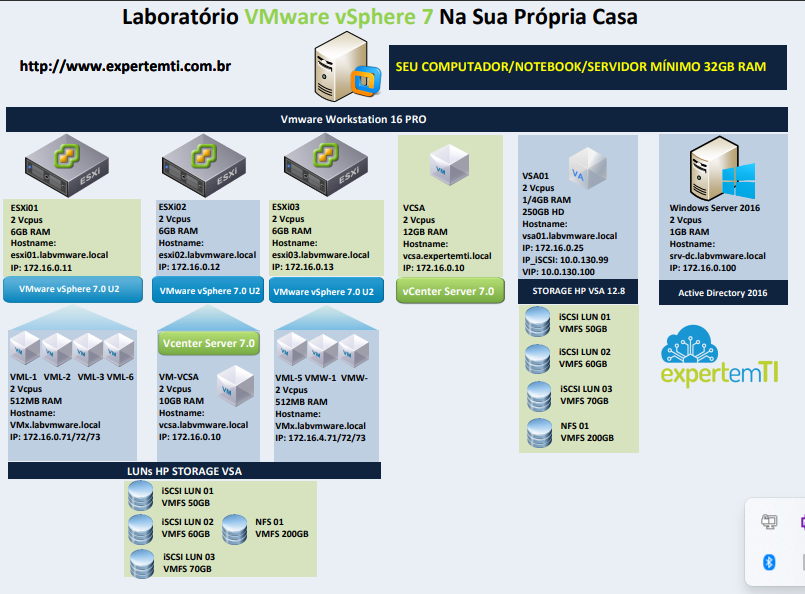

# 💻 VMware vSphere 8 Lab for VCP-DCV Certification

This repository documents the complete lab I designed and implemented as part of my preparation for the **VCP-DCV (VMware Certified Professional – Data Center Virtualization)** certification, which I have successfully achieved.  
The environment was built using **VMware vSphere 8** and served as a practical platform to consolidate the knowledge required for the official VMware exam.

---

## 🧰 Infrastructure Used

- **Physical Server:** HP ProLiant DL380p Gen8  
- **RAM:** 64 GB  
- **Storage:** 5x 300 GB SAS disks  
- **Base OS:** Windows Server 2016 (installed directly on the server)  
- **Virtualization Platform:** VMware Workstation 16 Pro (hosting all lab VMs)

---

## 🎯 Project Objective

The goal was to build a complete virtual datacenter lab environment to study and practice essential features of vSphere 8, including:

- vCenter Server deployment and management  
- ESXi hosts
- Linux and windows clients VM
- Virtual networking (vSwitches)  
- iSCSI storage (HP LUNs via VSA)  
- Active Directory integration  
- High Availability (HA)  
- Distributed Resource Scheduler (DRS)  
- Fault Tolerance (FT)  
- Virtual Machine lifecycle  
- vSAN, vMotion, and performance monitoring

---

## 🧱 Lab Architecture

> The entire environment was built **inside VMware Workstation 16 Pro**, which runs on top of a **Windows Server 2016** installed directly on the physical server.

### Virtual Components Deployed:

- **3x ESXi 8.0 U2 Hosts**  
- **1x vCenter Server 8.0**  
- **1x HP VSA (Storage Virtual Appliance) with iSCSI LUNs**  
- **1x Active Directory (Windows Server 2016)**  
- **Multiple VMs for testing and validation**

---

## 🗺️ Lab Topology

---

## 📄 Documentation

- [Lab Setup Guide (PDF)](docs/documentacao.pdf)

---

## 🛠️ Implementation Steps

1. VM provisioning inside VMware Workstation  
2. Installation of Windows Server 2016 as the host OS  
3. Installation of ESXi 8.0 on virtual machines  
4. vCenter Server deployment and configuration  
5. HP VSA deployment with iSCSI LUNs (VMFS and NFS)  
6. AD setup and vSphere domain integration  
7. Test VM creation  
8. Configuration of HA, FT, DRS, vMotion, and vSAN  
9. Monitoring and resource management via vCenter

---

## 📁 Repository Structure

| Folder            | Description                                                      |
|-------------------|------------------------------------------------------------------|
| `imagens/`        | Screenshots, topology diagrams, study maps                       |
| `docs/`           | Supporting documents, technical notes, PDFs, Visio files         |
| `configuracoes/`  | Configuration files, scripts, `.ovf`, `.txt`, etc.              |

---

## 🎓 Certification

> ✅ Certification Achieved: **VCP-DCV – VMware Certified Professional - Data Center Virtualization**

This lab was built as part of my successful preparation for the VCP-DCV certification. The hands-on experience gained through this environment was crucial to mastering the exam objectives, including core datacenter virtualization, vCenter management, vSAN, DRS, HA, FT, and performance optimization.

---

## 👨‍💻 About the Author

**Josemar Maximino**  
Systems & Infrastructure Administrator | On-Premises & Cloud Solutions  

🔗 [LinkedIn](https://www.linkedin.com/in/josemar-maximino-8bb974251?utm_source=share&utm_campaign=share_via&utm_content=profile&utm_medium=ios_app)  
📧 Email: josemarmateus2003@gmail.com

---

## 📌 Notes

This project is for educational purposes and aims to help students and IT professionals prepare for certification exams and develop practical skills in enterprise-grade virtualized environments.

---

## 🙏 Acknowledgements

This lab was inspired by the course **"Server Virtualization with VMware vSphere 7.0"** taught by **John Costa**, founder of the **Expert em TI** platform.  
The topology and core concepts are based on the training structure, with adaptations made to suit my physical server setup.  
🔗 [Expert em TI YouTube Channel](https://www.youtube.com/@ExpertemTI)
